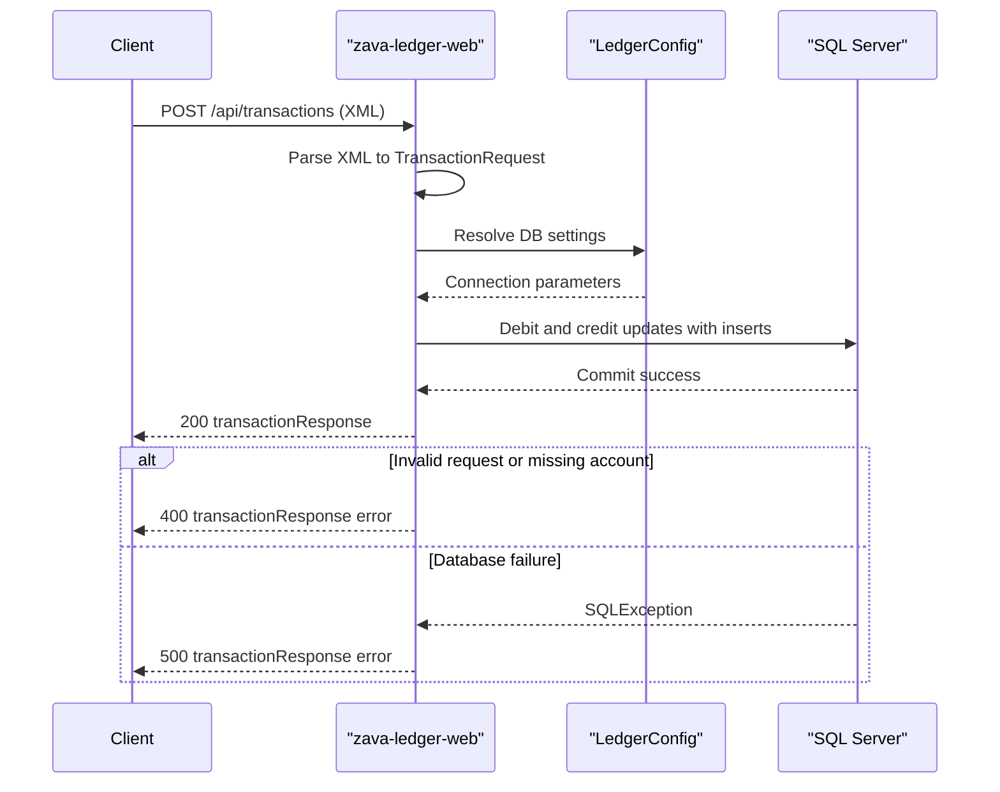

# API & Service Communication Contracts

ZavaLedger exposes a compact servlet-based XML API surface with three HTTP endpoints. Communication is synchronous request/response over HTTP and synchronous JDBC access to SQL Server.

## Service Catalog

| Service | Port | Category | Purpose |
|---|---:|---|---|
| zava-ledger-web | 8080 | Business | Monolithic ledger service providing health, transaction posting, and account query APIs |

## API Endpoints Inventory

| Service | Method | Path | Request Type | Response Type |
|---|---|---|---|---|
| zava-ledger-web (HealthServlet) | GET | /health | None | HTML health banner (200) |
| zava-ledger-web (TransactionServlet) | POST | /api/transactions | XML body with `TransactionRequest` fields | XML `transactionResponse` (200/400/500) |
| zava-ledger-web (AccountServlet) | GET | /api/accounts/{id}/balance | Path parameter `id` | XML `balanceResponse` (200/404/500) |
| zava-ledger-web (AccountServlet) | GET | /api/accounts/{id}/transactions | Path parameter `id` | XML `transactionsResponse` (200/500) |

## Management & Observability Endpoints

| Service | Endpoint | Custom Metrics (if any) |
|---|---|---|
| zava-ledger-web | GET /health | None detected |

## DTOs & Contracts

The API contracts are implemented as servlet XML payloads rather than dedicated DTO class hierarchies. `TransactionServlet.TransactionRequest` and `TransactionServlet.TransactionResult` act as service-level contract types for request parsing and response construction. API responses are generated as XML strings and escaped through `LedgerXml` for response safety.

## Communication Patterns

All communication patterns are synchronous: clients call servlet endpoints over HTTP, and servlets call SQL Server through JDBC in the same request path. No asynchronous messaging, retry framework, circuit breaker, service discovery, or gateway aggregation layer is implemented. Startup dependency is straightforward (servlet container plus reachable SQL Server). Security posture: no API authentication, no authorization checks, and no explicit HTTPS/TLS enforcement are configured in application code.

## Service Technology Matrix

| Service | Web | Data Access | Discovery | Gateway | Actuator | Cache | Metrics |
|---|---|---|---|---|---|---|---|
| zava-ledger-web | Java Servlet | JDBC | None | No | Health endpoint only | None | None |

## Service Communication Sequence

