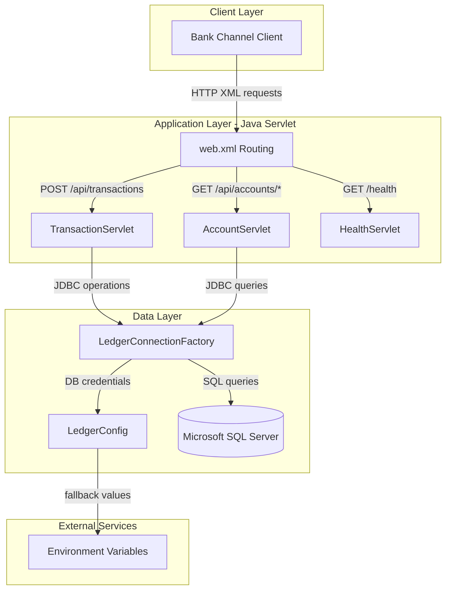
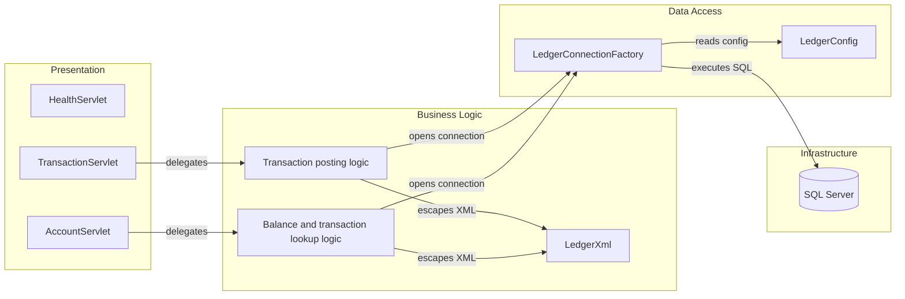

# Architecture Diagram

This document summarizes the current ZavaLedger runtime architecture and its core component relationships.

## Application Architecture

### Technology Stack Summary

| Layer | Technology | Version | Purpose |
|---|---|---|---|
| Presentation | Java Servlet API | 4.0.1 | Exposes HTTP endpoints via servlets |
| Build | Gradle | N/A (wrapper not committed) | Builds WAR artifact |
| Data Access | Microsoft JDBC Driver | 12.8.1.jre11 | SQL Server connectivity |
| Runtime | Apache Tomcat | 9.0 (Docker image) | Hosts ROOT.war |
| Database | Microsoft SQL Server | Not pinned in repo | Stores accounts and transactions |

### Data Storage & External Services

The application persists ledger data in Microsoft SQL Server and accesses it through plain JDBC statements. It also depends on environment-provided connection settings, with local defaults loaded from `ledger.properties` when environment variables are absent.

### Key Architectural Decisions

- Uses a servlet-based monolith packaged as a single WAR and deployed to Tomcat.
- Uses direct JDBC data access without a repository/ORM abstraction.
- Uses XML request/response payloads for transaction and account APIs.

## Component Relationships

### Component Inventory

| Component | Layer | Type | Responsibility |
|---|---|---|---|
| HealthServlet | Presentation | Servlet | Returns application health response |
| TransactionServlet | Presentation | Servlet | Parses transaction XML and posts ledger entries |
| AccountServlet | Presentation | Servlet | Serves account balance and transaction history APIs |
| LedgerXml | Business Logic | Utility | Escapes XML output content |
| LedgerConnectionFactory | Data Access | Factory | Creates JDBC connections to SQL Server |
| LedgerConfig | Data Access | Configuration | Resolves DB settings from environment or properties |
