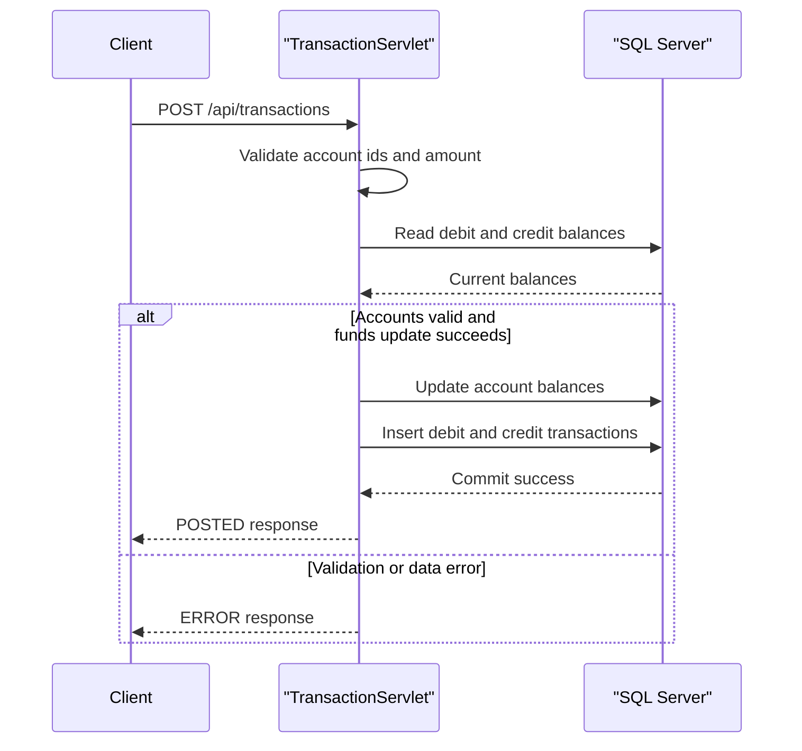

# Business Workflows

This document captures the primary ledger business workflows implemented by the service and the domain rules applied during request processing.

## Domain Entities

| Entity | Description |
|---|---|
| Account | Holds current and available balances for ledger accounts |
| Transaction | Records debit/credit ledger entries and metadata |
| TransactionType | Determines whether an entry is debit or credit |

## Service-to-Domain Mapping

| Service/Component | Domain Responsibilities |
|---|---|
| TransactionServlet | Validates and posts transfer transactions between two accounts |
| AccountServlet | Reads account balances and transaction history |
| HealthServlet | Provides basic availability check |

## Primary Workflows

| Workflow | Trigger | Outcome |
|---|---|---|
| Post transfer transaction | POST `/api/transactions` | Debit and credit entries committed and returned |
| Query account balance | GET `/api/accounts/{id}/balance` | Balance snapshot returned or not found |
| Query account transactions | GET `/api/accounts/{id}/transactions` | Ordered transaction list returned |

## Cross-Service Data Flows

No cross-service calls are detected. All workflow data access is local from servlets to SQL Server.

## Business Workflow Sequence

## Business Rules & Decision Logic

- Debit and credit account IDs must be different.
- Transaction amount must be greater than zero.
- Both accounts must exist before posting updates.
- Debit and credit entries are committed in one DB transaction with rollback on failure.
