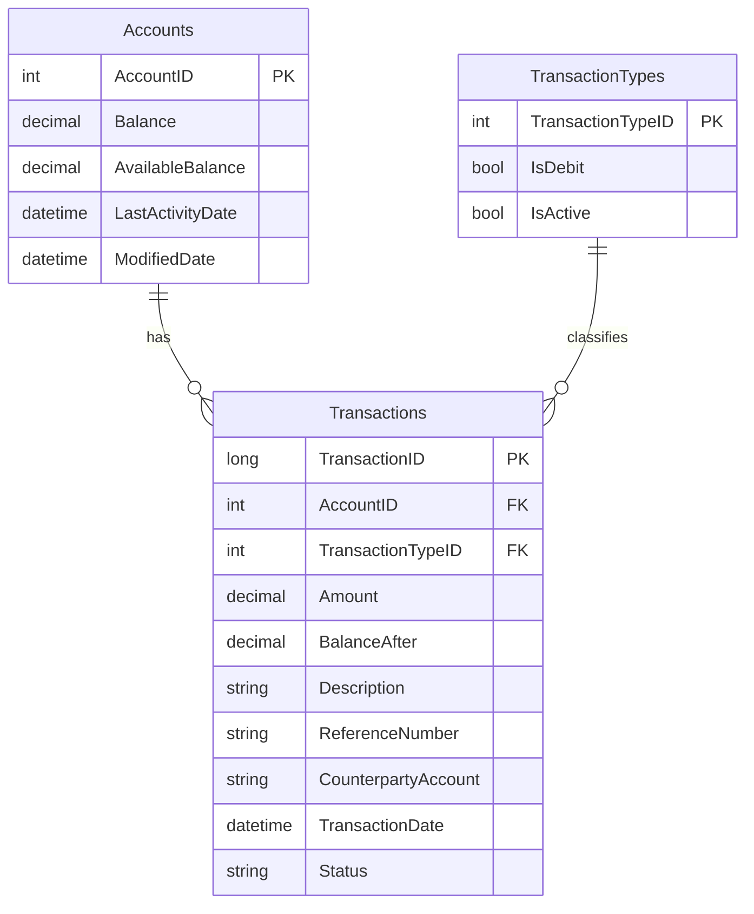

# Data Architecture & Persistence Layer

The data layer is implemented with direct JDBC access to a single SQL Server database. Persistence concerns are managed in servlet classes and helper utilities without an ORM framework.

## Database Configuration

| Service/Module | DB Type | Profile | Driver | Connection | Migration Tool |
|---|---|---|---|---|---|
| zava-ledger-web | SQL Server | default | com.microsoft.sqlserver:mssql-jdbc 12.8.1.jre11 | JDBC URL assembled from env vars or `ledger.properties` | None detected |

## Data Ownership per Service

| Service | Tables Owned | ORM Framework | Caching | Notes |
|---|---|---|---|---|
| zava-ledger-web | Accounts, Transactions, TransactionTypes | Plain JDBC (no ORM) | None | Single service owns all observed data access |

## Entity Model

## Key Repository Methods

| Service | Repository | Notable Methods | Purpose |
|---|---|---|---|
| zava-ledger-web | TransactionServlet (`src/main/java/com/zavabank/ledger/TransactionServlet.java`) | `readBalance`, `findTransactionType`, `updateAccountBalance`, `insertTransaction` | Executes transactional debit/credit posting workflow |
| zava-ledger-web | AccountServlet (`src/main/java/com/zavabank/ledger/AccountServlet.java`) | Prepared SELECT queries in `writeBalance` and `writeTransactions` | Reads account balances and transaction history |

## Caching Strategy

No caching provider or cache annotations were detected. All requests query SQL Server directly, and responses are built from current query results.

## Data Ownership Boundaries

The application uses a shared, single-database model owned by one deployable service. Cross-service data access patterns are not present, and read/write operations are handled directly in servlet request handlers using SQL statements and local transaction boundaries.

### Data Classification & Sensitivity

| Entity | Sensitive Fields | Classification (PII/PHI/PCI/None) | Controls in Place |
|---|---|---|---|
| Accounts | Potential account ownership and balance values | PII | No field-level masking or encryption controls detected in code |
| Transactions | Description, reference number, counterparty account | PII | No field-level masking or encryption controls detected in code |
| TransactionTypes | None observed | None | N/A |
