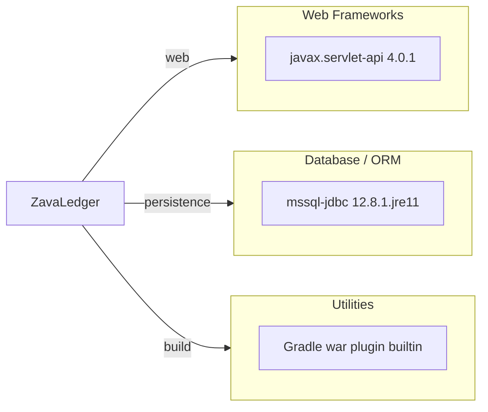

# Dependency Map

This map summarizes declared external dependencies for ZavaLedger from Gradle build files. The project declares 2 runtime/compile dependencies and no test-scoped dependencies.

## Dependencies

### Dependency Summary

| Category | Count | Key Libraries | Notes |
|---|---:|---|---|
| Web Frameworks | 1 | javax.servlet-api 4.0.1 | Provided servlet contract for container runtime |
| Database / ORM | 1 | mssql-jdbc 12.8.1.jre11 | Direct JDBC driver for SQL Server |
| Utilities | 1 | Gradle Java and War plugins | Packaging and compilation plugins |

### Version & Compatibility Risks

The application relies on `javax.servlet` APIs which are legacy in newer Jakarta-based runtime ecosystems and may require namespace migration (`javax.*` to `jakarta.*`) for future upgrades. The SQL Server JDBC driver is modern, but runtime compatibility should be validated alongside target Java runtime changes.

### Notable Observations

- Dependency graph is intentionally small and uses direct servlet plus JDBC APIs.
- No explicit logging, caching, or security libraries are declared in Gradle dependencies.
- The servlet API dependency is compile-only, so runtime compatibility depends on the target container.

## Test Dependencies

| Framework | Version | Notes |
|---|---|---|
| None detected | N/A | No test-scoped dependencies are declared in `build.gradle`. |

Total test-scope dependencies: 0

No test infrastructure dependencies were detected in build files.
