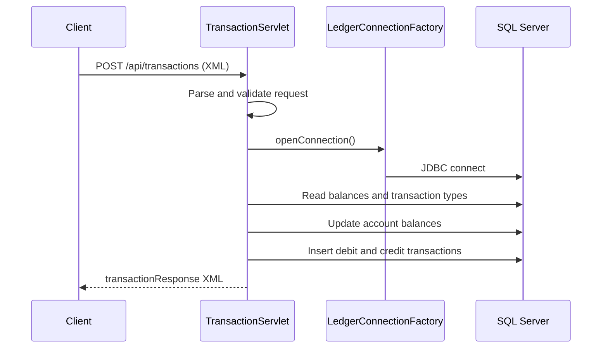

# API and Service Communication Contracts

## External API Contracts

### `GET /health`
- Purpose: Health probe
- Response: HTML body with service online message

### `GET /api/accounts/{id}/balance`
- Purpose: Retrieve balance and available balance for an account
- Response (XML): `balanceResponse` with `status`, `accountId`, `balance`, `availableBalance`

### `GET /api/accounts/{id}/transactions`
- Purpose: Retrieve transaction history for an account
- Response (XML): `transactionsResponse` with repeated `transaction` entries

### `POST /api/transactions`
- Purpose: Post funds transfer between two accounts
- Request (XML): `debitAccountId`, `creditAccountId`, `amount`, `description`, `referenceNumber`
- Response (XML): `transactionResponse` with status and created transaction IDs

## Internal Service Communication

