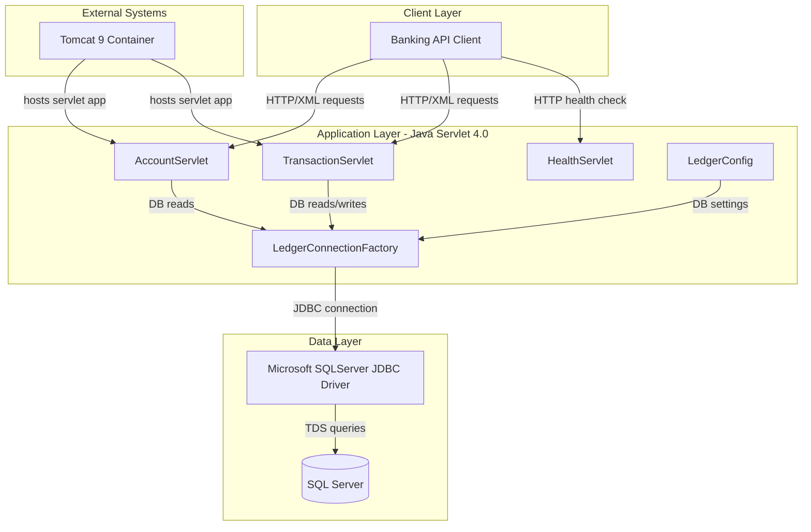
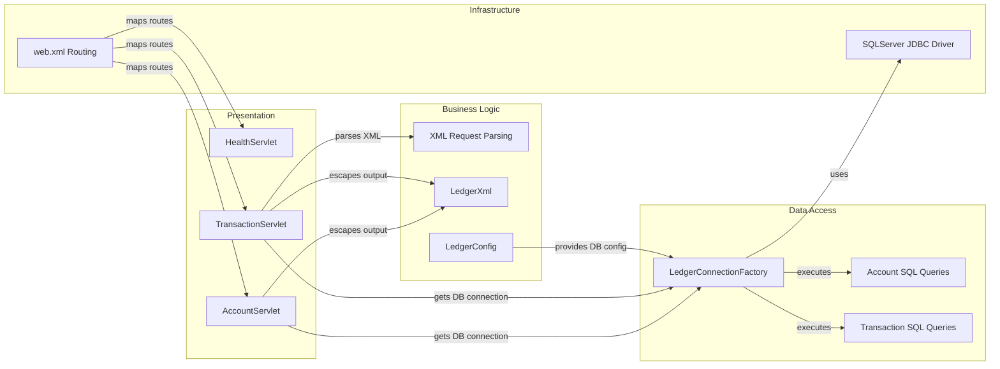

# Architecture Diagram

This document summarizes the current ZavaLedger architecture at the application and component levels.

## Application Architecture

### Technology Stack Summary

| Layer | Technology | Version | Purpose |
|---|---|---|---|
| Presentation | Java Servlets + JSP | Servlet 4.0 | Exposes HTTP endpoints and simple UI |
| Business Logic | Java classes in `com.zavabank.ledger` | Java 17 | Request parsing and ledger transaction logic |
| Data Access | JDBC via SQL Server driver | mssql-jdbc 12.8.1.jre11 | Executes account and transaction SQL operations |
| Runtime | Apache Tomcat container | 9.0-jdk17 | Hosts WAR deployment |
| Build | Gradle | 7.x/9.x compatible build scripts | Builds WAR artifact |

### Data Storage & External Services

The application stores account and transaction data in a SQL Server database (`Accounts`, `Transactions`, and `TransactionTypes` tables). It has no cache or message broker dependencies and relies on JDBC over the SQL Server driver for all data access.

### Key Architectural Decisions

- Uses a straightforward servlet-based monolithic architecture with XML request/response payloads.
- Centralizes DB connection construction in `LedgerConnectionFactory` and environment/property resolution in `LedgerConfig`.
- Uses prepared SQL statements for database interactions in account and transaction endpoints.

## Component Relationships

### Component Inventory

| Component | Layer | Type | Responsibility |
|---|---|---|---|
| `HealthServlet` | Presentation | Servlet | Returns service health response |
| `AccountServlet` | Presentation | Servlet | Serves account balance and transaction history endpoints |
| `TransactionServlet` | Presentation | Servlet | Processes posted transactions and writes ledger entries |
| `LedgerXml` | Business Logic | Utility | Escapes XML output values |
| `LedgerConfig` | Business Logic | Configuration utility | Resolves DB settings from env vars/properties |
| `LedgerConnectionFactory` | Data Access | Factory | Creates JDBC connections |
| SQL query blocks in servlets | Data Access | JDBC statements | Reads/updates account and transaction tables |
| `web.xml` | Infrastructure | Servlet descriptor | Maps endpoint paths to servlet classes |
