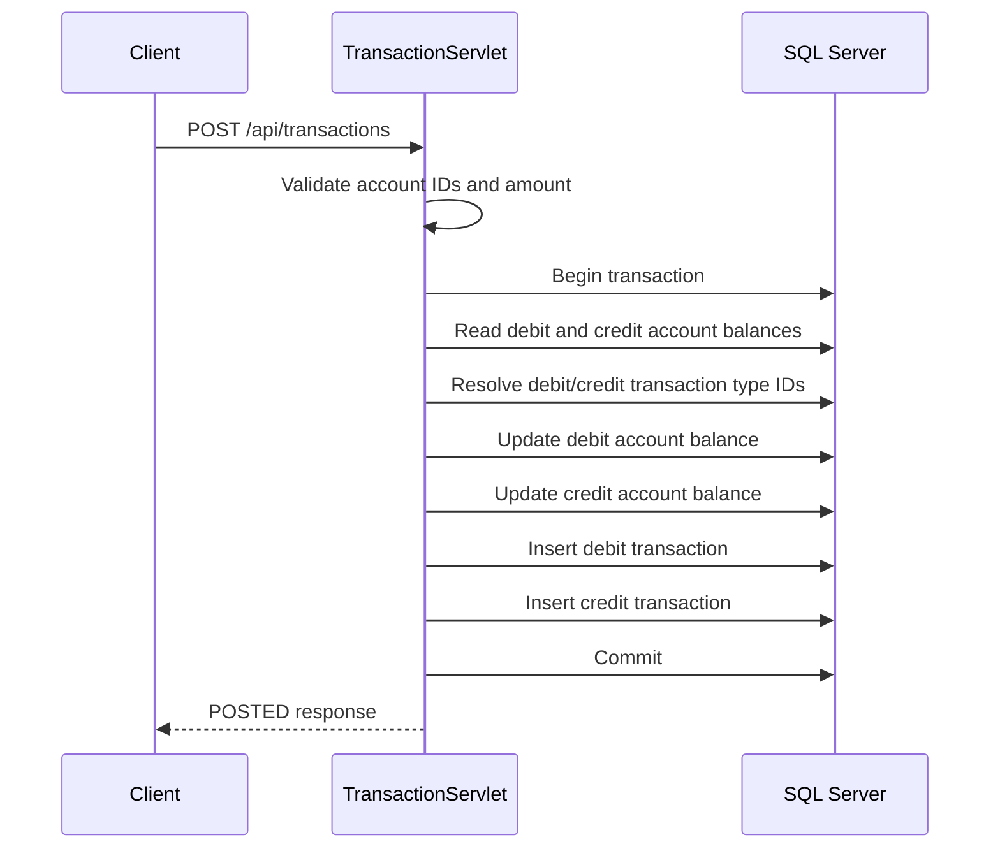
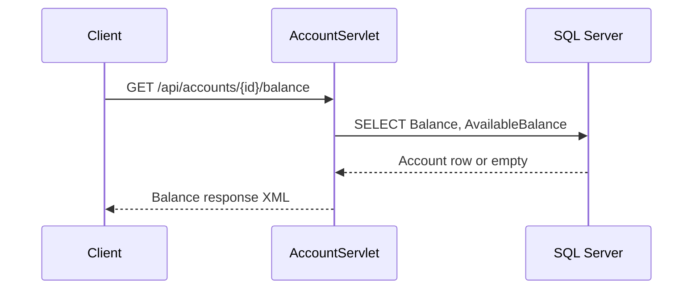

# Business Workflows

## Funds Transfer Workflow

```mermaid
sequenceDiagram
    participant Client
    participant API as TransactionServlet
    participant DB as SQL Server

    Client->>API: POST /api/transactions
    API->>API: Validate account IDs and amount
    API->>DB: Begin transaction
    API->>DB: Read debit and credit account balances
    API->>DB: Resolve debit/credit transaction type IDs
    API->>DB: Update debit account balance
    API->>DB: Update credit account balance
    API->>DB: Insert debit transaction
    API->>DB: Insert credit transaction
    API->>DB: Commit
    API-->>Client: POSTED response
```

## Account Inquiry Workflow

```mermaid
sequenceDiagram
    participant Client
    participant API as AccountServlet
    participant DB as SQL Server

    Client->>API: GET /api/accounts/{id}/balance
    API->>DB: SELECT Balance, AvailableBalance
    DB-->>API: Account row or empty
    API-->>Client: Balance response XML
```
