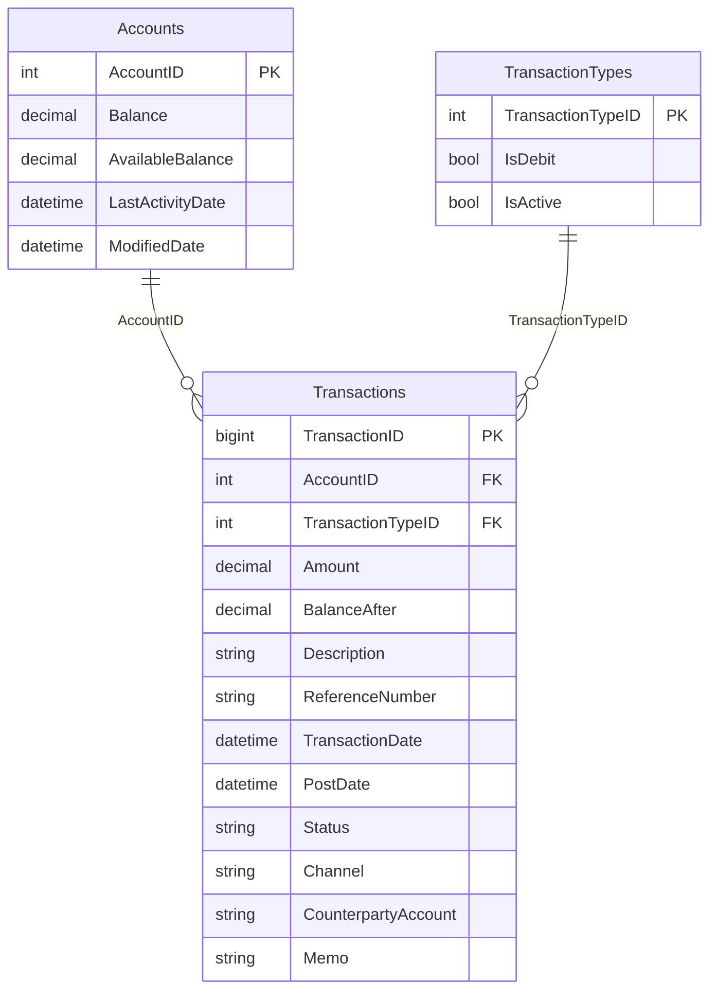

# Data Architecture

The application uses SQL Server as the sole persistence store. Transaction posting updates account balances and inserts transaction ledger records within a single JDBC transaction.
