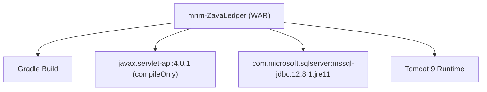

# Dependency Map

```mermaid
flowchart TD
    App["mnm-ZavaLedger (WAR)"] --> Gradle["Gradle Build"]
    App --> ServletApi["javax.servlet-api:4.0.1 (compileOnly)"]
    App --> SqlJdbc["com.microsoft.sqlserver:mssql-jdbc:12.8.1.jre11"]
    App --> Tomcat["Tomcat 9 Runtime"]
```

- Build tool: Gradle (`java`, `war` plugins)
- Runtime packaging: WAR deployed to Tomcat
- Core external dependency: Microsoft SQL Server JDBC driver
